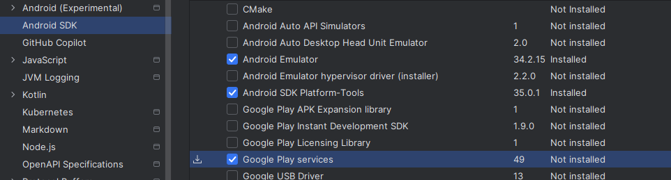
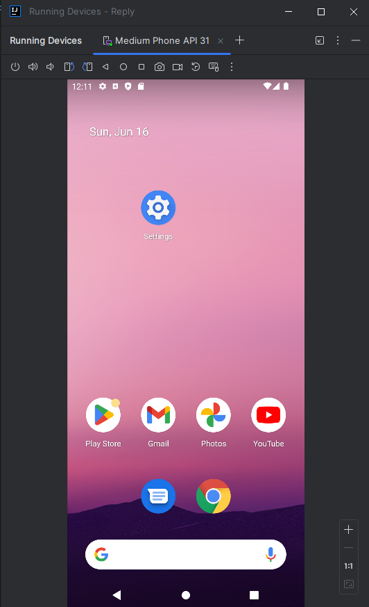

# Pacheco Cruz Eduardo | 6NM61 |

## Comprensión: Google Maps Platform y el SDK de Places

### Instalacion de los Serivicos de Google Play:

### Instrucciones del emulador: Actualiza los Servicios de Google Play

Entramos al icono de tres puntos y actualizamos los servicios de Google Play.

Configuramos el emulador para que tenga una ubicación en específico.

### final de la app despues de seguir el colab:

No use ninguna api de android porque creo que pide dinero a cloud services o algo asi y no lo quise hacer.
